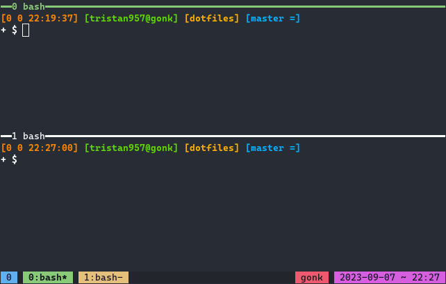

<!-- markdownlint-disable-next-line MD041 -->

# dotfiles

These are my personal configuration files.

## GNU Stow

This repository uses GNU `stow` to manage `dotfiles`.

- 1password
- aerc
- asdf
- bash
- bat
- bun
- cargo
- chawan
- clangd
- cloud-desktop
- comlink
- containers
- delta
- deno
- desktop-database
- dir_colors
- direnv
- dotnet
- editline
- fish
- fzf
- gdb
- ghostty
- git
- glab
- glow
- go
- harper
- helix
- home-manager
- homebrew
- hut
- info
- jj
- jq
- jupyter
- kubernetes
- lazygit
- less
- man
- meson
- mjmap
- neovim
- nix
- nnn
- node
- npm
- nvm
- opencode
- pgrx
- postgresql
- programs
- ptyxis
- python
- readline
- ripgrep
- rlwrap
- ssh
- sway
- systemd
- testcontainers
- tmpfiles
- tmux
- truecolor
- toolbox
- vim
- vscodium
- work
- xdg
- zoxide
- zsh

The above is a list of packages `stow(8)` can be used on. That syntax looks like
`stow {package}`.

## Terminal

### Bash

`PS0` from left to right:

- return code of previous command
- number of jobs currently managed by the shell
- 24-hr time
- username@hostname
- current directory
- git branch

2nd line:

- root/user (`#` or `$`)

### tmux

Statusline from left to right:

- session
- window list
  - current window
  - random window
  - last window
- hostname
- date
- 24-hr time
