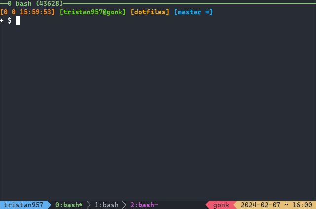

# dotfiles

These are my personal configuration files.

## GNU Stow

This repository uses GNU `stow` to manage `dotfiles`.

- aerc
- alacritty
- bash
- bat
- cargo
- clangd
- foot
- gdb
- git
- less
- libedit
- npm
- nvim
- programs
- psql
- readline
- ssh
- sway
- systemd
- teleport
- terraform
- tmux
- vim
- vscodium
- yarn

The above is a list of packages `stow(8)` can be used on. That syntax looks like
`stow {package}`.

## Terminal

### Bash

`PS0` from left to right:

- return code of previous command
- number of jobs currently managed by the shell
- 24-hr time
- username@hostname
- current directory
- git branch

2nd line:

- root/user (`#` or `$`)

### tmux

Statusline from left to right:

- session
- window list
- hostname
- date
- 24-hr time
